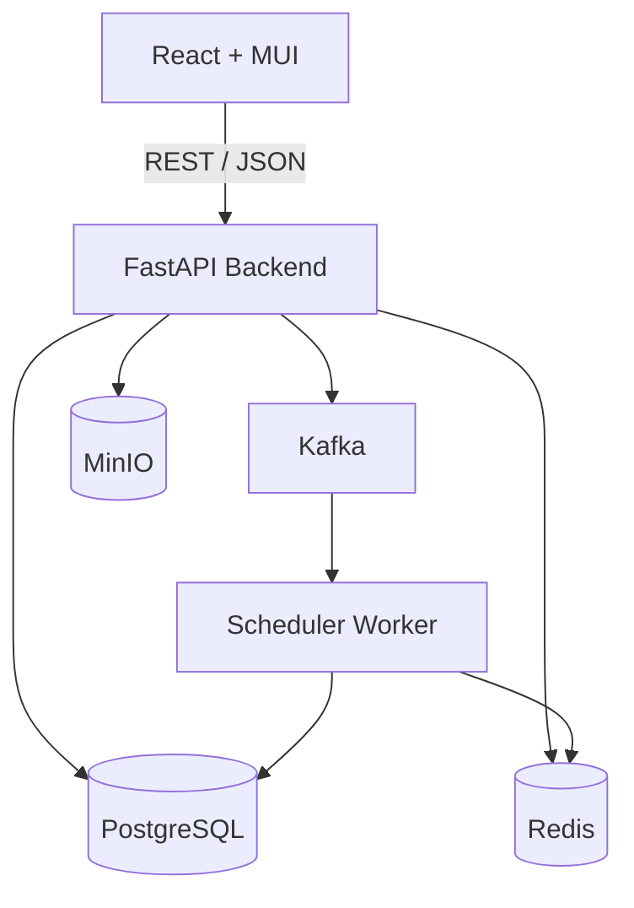

# Lessons Schedules Service

Сервис автоматического составления, проверки, редактирования и оптимизации расписания занятий на двухнедельный цикл.

## Возможности

- регистрация и авторизация пользователей;
- несколько проектов расписаний на пользователя;
- преподаватели, аудитории, группы, подгруппы и потоки;
- очные и дистанционные занятия;
- обязательные ограничения и предпочтения преподавателей;
- один оптимальный или `TOP-N` вариантов расписания;
- проверка и оптимизация существующего расписания;
- импорт и экспорт `.xlsx`, `.ods`, `.csv`, `.json`;
- хранение загруженных файлов и истории выгрузок.

## Стек

### Frontend

- React
- MUI

### Backend

- Python 3.12
- FastAPI
- SQLAlchemy

### Infrastructure

- PostgreSQL
- Redis
- Kafka
- MinIO
- Docker Compose

## Архитектура



Backend обрабатывает HTTP API и пользовательские операции.

Scheduler Worker выполняет длительные задачи построения и оптимизации расписания.

PostgreSQL является постоянным хранилищем данных. Redis используется для краткоживущего состояния расчётов и запросов на отмену. Kafka передаёт расчётные задания Worker. MinIO хранит исходные загруженные файлы и историю экспортов.

## Структура репозитория

```text
/
├── backend/
│   ├── app/
│   │   ├── api/
│   │   ├── application/
│   │   ├── domain/
│   │   ├── infrastructure/
│   │   ├── scheduling/
│   │   └── worker/
│   ├── tests/
│   ├── alembic/
│   └── pyproject.toml
├── frontend/
│   ├── src/
│   ├── tests/
│   └── package.json
├── docs/
│   ├── FS.md
│   └── HLD.md
├── test-data/
│   └── minimal-project.json
├── .github/
│   ├── workflows/
│   └── pull_request_template.md
├── docker-compose.yml
├── .env.example
├── .editorconfig
├── .gitignore
└── README.md
```

## Локальный запуск инфраструктуры

Создать локальный файл окружения:

```bash
cp .env.example .env
```

Запустить инфраструктуру:

```bash
docker compose up -d
```

Проверить состояние:

```bash
docker compose ps
```

На стартовом этапе Docker Compose поднимает PostgreSQL, Redis, Kafka и MinIO. Backend, Scheduler Worker и Frontend запускаются локально до появления их Dockerfile.

## Backend

Из каталога `backend`:

```bash
python -m venv .venv
source .venv/bin/activate
python -m pip install --upgrade pip
pip install -e ".[dev]"
uvicorn app.main:app --reload
```

Проверка:

```text
GET http://localhost:8000/health
```

## Frontend

Из каталога `frontend`:

```bash
npm install
npm run dev
```

## Git workflow

Используется GitHub Flow.

Основная ветка:

```text
main
```

Рабочие ветки создаются от актуальной `main`.

Префиксы:

```text
feature/
fix/
refactor/
infra/
docs/
```

Примеры:

```text
feature/auth-api
feature/project-editor
feature/groups-subgroups
feature/scheduler-jobs
infra/docker-compose
fix/room-validation
docs/trello-workflow
```

Прямые коммиты в `main` запрещены Ruleset. Изменения попадают в `main` только через Pull Request.

Для merge требуется:

- минимум одно одобрение другого участника;
- успешное прохождение обязательных CI checks;
- отсутствие нерешённых review comments;
- соответствие Definition of Done.

## Управление задачами

Единым источником состояния задач команды является **Trello**.

GitHub Project Board для проекта не используется. GitHub Issues не являются основным инструментом планирования и не должны дублировать карточки Trello.

В Trello рекомендуется использовать статусы:

```text
Backlog → Ready → In Progress → Review → Done
                         ↓
                      Blocked
```

Для каждой карточки разработки желательно указывать:

- исполнителя;
- область: Frontend / Backend / DB / Scheduler / DevOps / Docs;
- приоритет: High / Medium / Low;
- контрольную дату;
- размер: S / M / L;
- связанные требования FS;
- связанные разделы HLD;
- блокирующие зависимости при наличии.

В течение одной контрольной недели у участника желательно держать не более двух задач одновременно в `In Progress`.

На еженедельном созвоне команда проходит задачи в порядке:

```text
Review → Blocked → In Progress → Ready
```

Обсуждаются конкретные результаты, блокеры, переносы контрольных дат и задачи до следующего созвона.

## Pull Request

Шаблон PR находится в `.github/pull_request_template.md`.

В PR указываются:

- что изменено;
- связанные требования FS;
- связанные разделы HLD;
- способ проверки;
- добавленные или изменённые тесты;
- ссылка на связанную карточку Trello.

Рекомендуемый процесс:

```text
Trello card
    ↓
рабочая ветка
    ↓
Pull Request
    ↓
review + CI
    ↓
merge в main
    ↓
карточка Trello → Done
```

## Definition of Done

Задача считается завершённой, если:

- реализованы требования FS, указанные в карточке Trello;
- реализация соответствует HLD;
- изменение попало в `main` через Pull Request;
- Pull Request одобрен другим участником;
- обязательные CI checks успешно пройдены;
- проект собирается и запускается;
- автоматические тесты проходят;
- ранее реализованная функциональность не сломана;
- документация обновлена, если изменение затрагивает публичный контракт или архитектуру;
- карточка Trello переведена в `Done`.

## CI

Для каждого Pull Request и push в `main` запускаются независимые проверки Backend и Frontend.

Backend:

```text
install
lint
test
```

Frontend:

```text
install
lint
test
build
```

Workflow-файлы находятся в `.github/workflows`.

## Документация

- `docs/FS.md` — функциональная спецификация;
- `docs/HLD.md` — High-Level Design.

## Тестовые данные

`test-data/minimal-project.json` содержит общий интеграционный набор данных для Frontend, Backend, Scheduler и интеграционных тестов.
