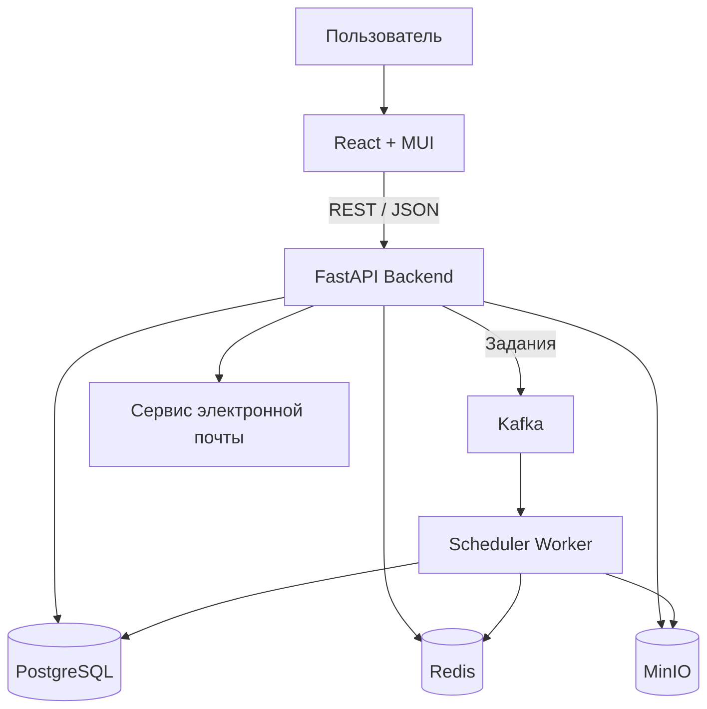
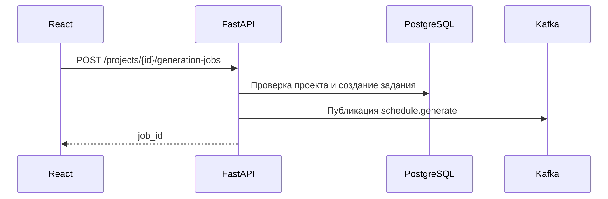
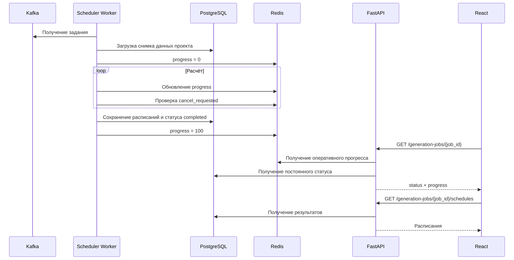
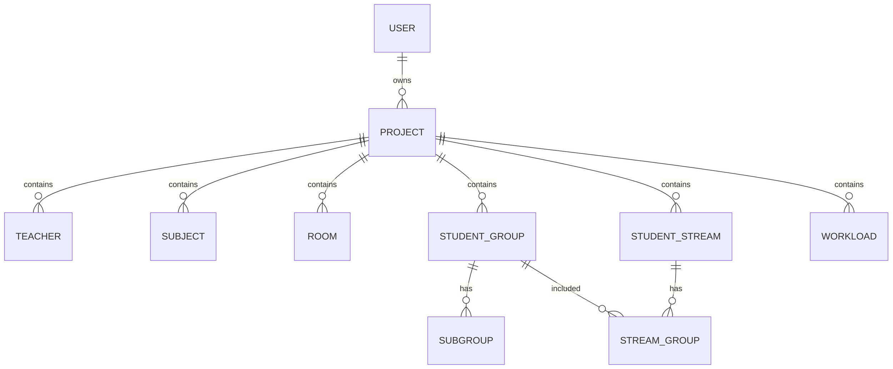
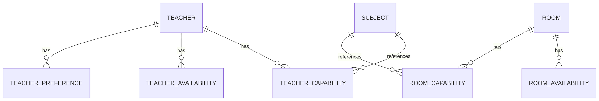
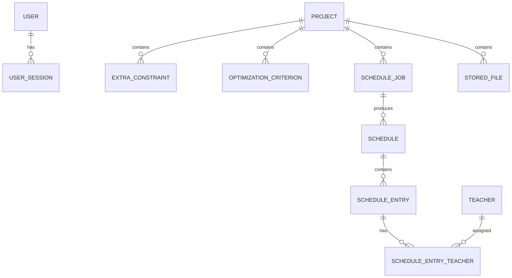
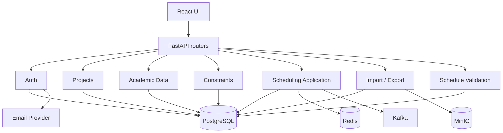
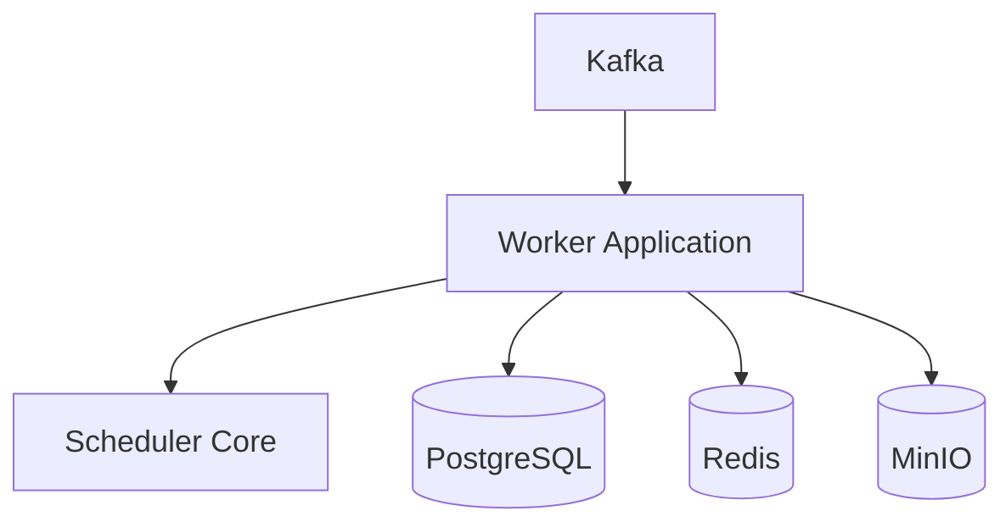

# High-Level Design
## Сервис автоматического составления расписания занятий

## 1. Общая архитектура

Система строится как веб-приложение с отдельным процессом выполнения длительных расчётов.

Основные компоненты:

- **Frontend** — React + MUI;
- **Backend API** — Python + FastAPI;
- **ORM** — SQLAlchemy;
- **основная БД** — PostgreSQL;
- **брокер сообщений** — Kafka;
- **оперативное состояние расчётов** — Redis;
- **файловое хранилище** — MinIO;
- **процесс расчёта расписания** — Scheduler Worker;
- **локальное окружение и развёртывание** — Docker Compose.

Backend реализуется как модульное приложение. Бизнес-логика не размещается в FastAPI-обработчиках и отделяется от HTTP, SQLAlchemy, Kafka, Redis и MinIO через прикладные интерфейсы.



### Назначение компонентов

| Компонент | Назначение |
|---|---|
| React + MUI | Пользовательский интерфейс, ввод данных, просмотр и редактирование расписания, отображение прогресса расчёта |
| FastAPI | HTTP API, авторизация, управление проектами и исходными данными, валидация запросов, запуск расчётов, импорт и экспорт |
| SQLAlchemy | Доступ Backend и Scheduler Worker к PostgreSQL |
| PostgreSQL | Постоянное хранение пользователей, проектов, исходных данных, ограничений, заданий и результатов расчётов |
| Kafka | Передача длительных задач построения и оптимизации расписания от Backend к Scheduler Worker |
| Redis | Текущий прогресс длительного расчёта, запросы на отмену и другое краткоживущее состояние |
| Scheduler Worker | Выполнение комбинаторного поиска, оптимизации и автоматической корректировки расписания |
| MinIO | Хранение загруженных пользователем файлов и созданных системой файлов выгрузок |
| Сервис электронной почты | Отправка сообщений для восстановления пароля |
| Docker Compose | Запуск всех внутренних компонентов системы в едином окружении |

---

## 2. Развёртывание

Docker Compose поднимает следующие контейнеры:

```text
frontend
backend
scheduler-worker
postgres
redis
kafka
minio
```

Backend и Scheduler Worker используют один программный пакет доменной и прикладной логики, но запускаются как разные процессы.

Kafka используется как брокер для асинхронных расчётных задач. Scheduler Worker получает задания из Kafka и выполняет их независимо от жизненного цикла HTTP-запроса.

Redis не используется как постоянное хранилище. После завершения расчёта постоянные результаты сохраняются в PostgreSQL.

MinIO используется как S3-совместимое объектное хранилище. В PostgreSQL хранятся метаданные файлов и ссылки на объекты MinIO.

---

## 3. Основные модули системы

### 3.1. Frontend

Frontend разделяется на функциональные области:

- `Auth` — регистрация, вход, восстановление пароля;
- `Projects` — список проектов, создание, открытие и удаление;
- `ProjectEditor` — редактирование преподавателей, аудиторий, групп, подгрупп, потоков и учебной нагрузки;
- `Constraints` — обязательные ограничения и критерии оптимизации;
- `Generation` — запуск расчёта, прогресс, отмена;
- `ScheduleViewer` — просмотр нечётной и чётной недель, переключение TOP-N вариантов;
- `ScheduleEditor` — ручное редактирование и отображение конфликтов;
- `ImportExport` — загрузка исходных файлов, история загруженных файлов и выгрузок.

Frontend не содержит бизнес-правил составления расписания. Все проверки, влияющие на допустимость результата, выполняются Backend или Scheduler Worker.

### 3.2. Backend

Backend состоит из следующих прикладных модулей:

#### Auth

Отвечает за:

- регистрацию;
- авторизацию;
- access/refresh JWT;
- завершение сессии;
- восстановление пароля;
- проверку прав доступа к проекту.

#### Projects

Отвечает за:

- создание проекта;
- обязательное имя проекта;
- получение списка проектов;
- сохранение и удаление проекта;
- проверку принадлежности проекта пользователю.

#### AcademicData

Отвечает за CRUD-операции и локальную валидацию:

- преподавателей;
- дисциплин;
- аудиторий;
- групп;
- подгрупп;
- потоков;
- учебной нагрузки;
- доступности;
- предпочтений преподавателей.

#### Constraints

Отвечает за:

- дополнительные обязательные ограничения;
- критерии оптимизации;
- порядок приоритетов критериев.

#### Scheduling

Отвечает за:

- подготовку снимка исходных данных для расчёта;
- проверку предельных размеров;
- создание задания;
- отправку задания в Kafka;
- получение состояния расчёта;
- отмену расчёта;
- получение результатов;
- запуск полной повторной оптимизации;
- запуск оптимизации с минимизацией изменений;
- автоматическую корректировку после ручного изменения.

#### ScheduleValidation

Отвечает за проверку построенного или загруженного расписания:

- пересечения групп;
- пересечения подгрупп;
- конфликт группы с её подгруппами;
- пересечения преподавателей;
- пересечения аудиторий;
- доступность преподавателей и аудиторий;
- соответствие аудитории занятию;
- выполнение учебной нагрузки;
- дополнительные обязательные ограничения.

#### ImportExport

Отвечает за:

- приём `.xlsx`, `.ods`, `.csv`, `.json`;
- сопоставление полей;
- разбор импортируемых данных;
- создание файлов выгрузки;
- хранение истории загруженных файлов;
- хранение истории выгрузок;
- взаимодействие с MinIO.

### 3.3. Scheduler Worker

Scheduler Worker содержит прикладной слой выполнения расчётов и независимое ядро планировщика.

Основные операции:

- построение одного оптимального расписания;
- построение `TOP-N`;
- полная оптимизация существующего расписания;
- оптимизация с минимизацией изменений;
- автоматическая корректировка после зафиксированного пользователем изменения.

Worker получает из PostgreSQL неизменяемый набор входных данных, соответствующий заданию, и передаёт его в Scheduler Core.

Во время работы Worker:

1. обновляет прогресс в Redis;
2. периодически проверяет флаг отмены;
3. сохраняет найденные итоговые варианты в PostgreSQL;
4. завершает задание соответствующим состоянием.

### 3.4. Scheduler Core

Scheduler Core не зависит от FastAPI, SQLAlchemy, Kafka, Redis и MinIO.

Вход Scheduler Core представляет собой доменную модель:

- временная модель;
- преподаватели и их возможности;
- аудитории;
- группы, подгруппы и потоки;
- учебная нагрузка;
- ограничения;
- критерии оптимизации;
- режим результата.

Выход:

- один вариант расписания;
- набор `TOP-N`;
- информация об отсутствии допустимого решения;
- диагностические данные о найденных противоречиях.

Для лабораторного элемента учебной нагрузки хранится требуемое количество преподавателей:

- для лекции — `1`;
- для практики — `1`;
- для лабораторной работы — положительное целое число, заданное пользователем.

Конкретная стратегия поиска инкапсулируется за интерфейсом планировщика и может изменяться без изменения HTTP API и остальных модулей системы.

---

## 4. Взаимодействие компонентов при построении расписания





### Отмена расчёта

Frontend отправляет команду отмены в Backend. Backend устанавливает в Redis флаг `cancel_requested`.

Scheduler Worker проверяет этот флаг во время расчёта. После обнаружения флага Worker прекращает поиск и переводит задание в состояние `cancelled`.

Незавершённый результат не заменяет ранее сохранённое расписание.

---

## 5. Kafka

Kafka используется только для задач, которые не должны выполняться внутри HTTP-запроса.

Основной топик:

```text
schedule.jobs
```

Типы сообщений:

```text
GENERATE
REOPTIMIZE_FULL
REOPTIMIZE_MIN_CHANGES
AUTO_REPAIR
```

Минимальный состав сообщения:

```json
{
  "job_id": "...",
  "project_id": "...",
  "job_type": "GENERATE"
}
```

Полный набор исходных данных не передаётся через Kafka. Worker загружает данные из PostgreSQL по `job_id` и `project_id`.

Worker должен обрабатывать повторную доставку одного `job_id` без создания дублирующего результата.

---

## 6. Redis

Redis хранит только оперативное состояние.

Пример ключей:

```text
schedule-job:{job_id}:progress
schedule-job:{job_id}:cancel
```

`progress` содержит текущую оценку выполнения расчёта.

`cancel` содержит запрос на остановку расчёта.

Потеря данных Redis не должна приводить к потере проекта или готовых расписаний. Постоянный статус задания хранится в PostgreSQL.

---

## 7. MinIO

MinIO хранит файлы двух категорий.

### Загруженные файлы

Сохраняется оригинальный файл, загруженный пользователем:

- `.xlsx`;
- `.ods`;
- `.csv`;
- `.json`.

После разбора файла структурированные данные сохраняются в PostgreSQL. Исходный объект остаётся в MinIO и доступен в истории загрузок проекта.

### История выгрузок

Каждая сформированная пользователем выгрузка сохраняется как отдельный объект MinIO.

Для выгрузки в PostgreSQL хранятся:

- проект;
- пользователь;
- формат;
- тип выгрузки;
- дата создания;
- ключ объекта MinIO;
- имя файла;
- размер;
- связанное расписание при наличии.

Пользователь может повторно скачать ранее сформированный файл без повторной генерации.

Frontend не обращается к MinIO напрямую. Доступ к файлам выполняется через Backend с проверкой принадлежности проекта текущему пользователю.

---

## 8. Авторизация

Используется схема:

```text
access JWT + refresh token
```

### Access token

Используется для авторизации API-запросов и имеет короткий срок жизни.

### Refresh token

Используется для получения нового access token.

Refresh-сессии хранятся в PostgreSQL и могут быть отозваны при выходе пользователя.

Пароли не хранятся в открытом виде. Для хранения используется адаптивное криптографическое хеширование.

Backend проверяет принадлежность проекта пользователю до выполнения любой операции с проектом, расписанием или связанным файлом.

---

## 9. Модель данных

### 9.1. Основные сущности

#### 9.1.1. Пользователь, проект и учебные данные



#### 9.1.2. Возможности и доступность ресурсов



#### 9.1.3. Расчёты, результаты и файлы



### 9.2. Пользователь

`users`

Основные данные:

- `id`;
- `email`;
- `password_hash`;
- `created_at`.

`user_sessions`

Хранит refresh-сессии:

- `id`;
- `user_id`;
- `refresh_token_hash`;
- `expires_at`;
- `revoked_at`.

### 9.3. Проект

`projects`

Основные данные:

- `id`;
- `owner_id`;
- `name`;
- режим времени;
- минимальный временной шаг;
- режим длительности;
- единая длительность при соответствующем режиме;
- настройки двухнедельного цикла;
- `created_at`;
- `updated_at`.

### 9.4. Преподаватели

`teachers`

- `id`;
- `project_id`;
- ФИО.

`teacher_capabilities`

Определяет комбинации дисциплины и типа занятия, которые преподаватель может вести.

- `teacher_id`;
- `subject_id`;
- `lesson_type`.

`teacher_availability`

- преподаватель;
- неделя;
- день недели;
- время начала;
- время окончания.

`teacher_preferences`

Имеет ту же временную структуру, но используется только при оптимизации и не ограничивает допустимость расписания.

### 9.5. Аудитории

`rooms`

- `id`;
- `project_id`;
- номер/название;
- вместимость;
- тип аудитории.

Типы:

```text
LECTURE
PRACTICE_UNIVERSAL
PRACTICE_SPECIALIZED
LABORATORY
```

`room_availability`

- аудитория;
- неделя;
- день;
- начало;
- окончание.

`room_capabilities`

Для специализированных и лабораторных аудиторий:

- аудитория;
- дисциплина;
- тип/вид занятия.

### 9.6. Группы и подгруппы

`student_groups`

- `id`;
- `project_id`;
- название;
- количество студентов.

`subgroups`

- `id`;
- `group_id`;
- название;
- количество студентов.

Суммарное количество студентов подгрупп одной группы не может превышать размер основной группы.

### 9.7. Потоки

`student_streams`

- `id`;
- `project_id`;
- название.

`stream_groups`

Связывает поток с входящими в него группами.

### 9.8. Учебная нагрузка

`workloads`

Основные поля:

- `id`;
- `project_id`;
- `subject_id`;
- тип занятия;
- формат занятия;
- количество проведений за двухнедельный цикл;
- длительность;
- требуемое количество преподавателей.

Цель нагрузки задаётся одной из ссылок:

- `group_id`;
- `subgroup_id`;
- `stream_id`.

Для одного элемента нагрузки должна быть заполнена ровно одна из этих ссылок.

Формат:

```text
ONSITE
REMOTE
```

Для `REMOTE` аудитория при построении не назначается.

Для лекции и практики `required_teacher_count = 1`.

Для лабораторной работы `required_teacher_count >= 1`.

### 9.9. Дополнительные ограничения

`extra_constraints`

- `id`;
- `project_id`;
- тип ограничения;
- область применения;
- параметры ограничения.

Параметры конкретного типа ограничения хранятся как структурированные данные.

Примеры типов:

```text
MIN_START_TIME
MAX_END_TIME
ALLOWED_DAYS
EVERY_WEEK
CONSECUTIVE
NOT_CONSECUTIVE
MIN_GAP
BEFORE
FIXED_DAY
TIME_RANGE
```

### 9.10. Критерии оптимизации

`optimization_criteria`

- `project_id`;
- тип критерия;
- приоритет;
- активность.

Приоритет уникален в пределах активных критериев проекта.

### 9.11. Задания расчёта

`schedule_jobs`

- `id`;
- `project_id`;
- тип задания;
- состояние;
- режим результата;
- `top_n`;
- дата создания;
- дата начала;
- дата завершения;
- описание ошибки при наличии.

Состояния:

```text
QUEUED
RUNNING
COMPLETED
FAILED
CANCELLED
```

### 9.12. Расписания

`schedules`

- `id`;
- `job_id`;
- порядковый номер результата;
- данные оценки по критериям;
- дата создания.

`schedule_entries`

- `id`;
- `schedule_id`;
- `workload_id`;
- неделя;
- день;
- время начала;
- время окончания;
- `room_id`, nullable для дистанционного занятия.

`schedule_entry_teachers`

Связывает занятие с одним или несколькими преподавателями.

### 9.13. Файлы

`stored_files`

- `id`;
- `project_id`;
- `user_id`;
- категория файла;
- исходное имя;
- формат;
- MinIO object key;
- размер;
- дата создания;
- связанное расписание или задание при наличии.

Категории:

```text
UPLOAD
EXPORT
```

---

## 10. API

API использует JSON для прикладных запросов и `multipart/form-data` для загрузки файлов.

Основные группы маршрутов:

### Авторизация

```text
POST /auth/register
POST /auth/login
POST /auth/refresh
POST /auth/logout
POST /auth/password-reset/request
POST /auth/password-reset/confirm
```

### Проекты

```text
GET    /projects
POST   /projects
GET    /projects/{project_id}
PATCH  /projects/{project_id}
DELETE /projects/{project_id}
```

### Исходные данные

```text
/projects/{project_id}/teachers
/projects/{project_id}/subjects
/projects/{project_id}/rooms
/projects/{project_id}/groups
/projects/{project_id}/subgroups
/projects/{project_id}/streams
/projects/{project_id}/workloads
```

Для коллекций применяются стандартные операции получения, создания, изменения и удаления.

### Ограничения и оптимизация

```text
/projects/{project_id}/constraints
/projects/{project_id}/optimization-criteria
```

### Построение

```text
POST /projects/{project_id}/generation-jobs
GET  /generation-jobs/{job_id}
POST /generation-jobs/{job_id}/cancel
GET  /generation-jobs/{job_id}/schedules
```

### Расписания

```text
GET   /schedules/{schedule_id}
PATCH /schedules/{schedule_id}/entries/{entry_id}
POST  /schedules/{schedule_id}/validate
POST  /schedules/{schedule_id}/auto-repair
POST  /schedules/{schedule_id}/reoptimize
```

### Импорт и экспорт

```text
POST /projects/{project_id}/imports
GET  /projects/{project_id}/files
POST /projects/{project_id}/exports
GET  /files/{file_id}
DELETE /files/{file_id}
```

### Ошибки API

Ошибки возвращаются в единой форме:

```json
{
  "code": "ROOM_CAPACITY_CONFLICT",
  "message": "Вместимость аудитории недостаточна",
  "details": {}
}
```

---

## 11. Логика эквивалентных оптимальных вариантов

Критерии оптимизации сравниваются по заданному пользователем приоритету.

Если несколько найденных расписаний имеют одинаковый результат по всем выбранным критериям, дополнительная сортировка по содержимому расписания не выполняется.

Их взаимный порядок соответствует порядку получения Scheduler Core.

В режиме одного варианта возвращается первый найденный оптимальный вариант.

В режиме `TOP-N` при наличии большего количества равноценных вариантов сохраняются первые найденные варианты до заполнения `N` мест.

---

## 12. Работа с существующим расписанием

Загруженное расписание сохраняется независимо от результата его проверки.

Если исходных данных недостаточно, Backend выполняет только доступные проверки.

Если при проверке обнаружено хотя бы одно нарушение обязательного ограничения:

1. операция проверки завершается результатом `invalid`;
2. API возвращает список обнаруженных конфликтов;
3. расписание остаётся сохранённым;
4. пользователь может продолжить его редактирование.

Полная оптимизация может полностью изменить расположение занятий в пределах заданных ограничений.

При оптимизации с минимизацией изменений первым критерием является минимальное количество изменений исходных:

- дня;
- времени;
- формата;
- аудитории;
- преподавателей.

После этого применяются пользовательские критерии оптимизации.

---

## 13. Импорт и экспорт

### Импорт

Последовательность:

1. Backend принимает файл.
2. Оригинал сохраняется в MinIO.
3. Метаданные файла сохраняются в PostgreSQL.
4. Backend разбирает файл.
5. Пользователь при необходимости сопоставляет столбцы.
6. Валидные данные сохраняются в PostgreSQL.
7. Ошибочные строки возвращаются пользователю как результат импорта.

Ошибка разбора не удаляет оригинальный файл.

### Экспорт

Последовательность:

1. Пользователь выбирает расписание или полный проект.
2. Backend формирует файл требуемого формата.
3. Файл сохраняется в MinIO.
4. Метаданные добавляются в историю выгрузок.
5. Пользователь получает файл.

---

## 14. Макет интерфейса

### 14.1. Список проектов

```text
┌─────────────────────────────────────────────────────┐
│ Расписание                               Профиль     │
├─────────────────────────────────────────────────────┤
│ Мои проекты                          [Создать проект]│
│                                                     │
│ Университет, осень 2026        [Открыть] [Удалить] │
│ Тестовое расписание             [Открыть] [Удалить] │
└─────────────────────────────────────────────────────┘
```

### 14.2. Редактор проекта

```text
┌──────────────────────────────────────────────────────────────┐
│ Проект: Университет, осень 2026                             │
├──────────────────────────────────────────────────────────────┤
│ Преподаватели │ Аудитории │ Группы │ Нагрузка │ Ограничения │
├──────────────────────────────────────────────────────────────┤
│                                                              │
│                    Данные выбранного раздела                  │
│                                                              │
├──────────────────────────────────────────────────────────────┤
│ [Импорт]                           [Настройки] [Рассчитать]   │
└──────────────────────────────────────────────────────────────┘
```

### 14.3. Расчёт

```text
┌─────────────────────────────────────────────────────┐
│ Построение расписания                               │
├─────────────────────────────────────────────────────┤
│ Статус: выполняется                                 │
│ ███████████████░░░░░░░░░  63%                      │
│                                                     │
│                                      [Отменить]     │
└─────────────────────────────────────────────────────┘
```

### 14.4. Просмотр расписания

```text
┌──────────────────────────────────────────────────────────────┐
│ Вариант 2 из 5                  [←] [→]                      │
│ [Нечётная неделя] [Чётная неделя]                           │
├──────────┬──────────────┬──────────────┬─────────────────────┤
│ Время    │ Понедельник  │ Вторник      │ ...                 │
├──────────┼──────────────┼──────────────┼─────────────────────┤
│ 10:00    │ Физика       │ Математика   │                     │
│          │ 301          │ 302-1        │                     │
│          │ Иванов       │ Петров       │                     │
├──────────┼──────────────┼──────────────┼─────────────────────┤
│ ...                                                          │
├──────────────────────────────────────────────────────────────┤
│ [Проверить] [Оптимизировать] [Экспорт]                       │
└──────────────────────────────────────────────────────────────┘
```

Конфликтное занятие визуально выделяется. При выборе такого занятия отображается список причин конфликта.

---

## 15. Тестируемость

### 15.1. Границы модулей

Бизнес-логика отделена от HTTP и инфраструктуры.

FastAPI routers:

- преобразуют HTTP-запрос в прикладную команду;
- вызывают прикладной сервис;
- преобразуют результат в HTTP-ответ.

В routers не размещаются:

- правила допустимости расписания;
- оптимизация;
- работа с SQLAlchemy-сессиями на уровне бизнес-правил;
- непосредственная работа с Kafka, Redis или MinIO.

Scheduler Core представляет отдельный модуль без инфраструктурных зависимостей.

### 15.2. Точки подмены зависимостей

Прикладные модули используют абстракции:

```text
UserRepository
ProjectRepository
AcademicDataRepository
ScheduleRepository
JobRepository
JobPublisher
JobStateStore
ObjectStorage
MailSender
TokenService
ScheduleSolver
Clock
IdGenerator
```

Рабочие реализации:

```text
SQLAlchemy repositories
KafkaJobPublisher
RedisJobStateStore
MinioObjectStorage
SMTPMailSender
JwtTokenService
```

В модульных и интеграционных тестах они могут заменяться fake/mock-реализациями.

### 15.3. Управление состоянием и временем

Текущее время не должно запрашиваться напрямую внутри бизнес-логики.

Для операций, зависящих от времени, используется `Clock`.

Генерация идентификаторов выполняется через `IdGenerator`.

Это позволяет воспроизводимо тестировать:

- срок действия токенов;
- дату создания файлов;
- состояния заданий;
- временные ограничения.

Scheduler Core не использует случайный выбор как источник недетерминированного результата без возможности задать источник случайности извне.

Если стратегия поиска использует псевдослучайность, генератор и seed передаются через абстракцию.

### 15.4. Тестовое окружение

Для интеграционных тестов Docker Compose может поднять:

- PostgreSQL;
- Redis;
- Kafka;
- MinIO.

Frontend и Backend тестируются отдельно.

Сервис электронной почты в тестах заменяется fake-реализацией.

Scheduler Core может тестироваться без запуска Docker-контейнеров.

Тестовые данные создаются программно перед тестом и очищаются после его выполнения.

### 15.5. Наблюдаемость

Backend и Worker используют структурированные логи.

Каждое длительное задание имеет `job_id`, который включается в связанные записи логов.

Для HTTP-запроса используется `request_id`.

Наблюдаемые состояния задания:

```text
QUEUED
RUNNING
COMPLETED
FAILED
CANCELLED
```

Успешность операции определяется через:

- HTTP-код и тело ответа;
- состояние задания;
- сохранённый результат в PostgreSQL;
- состояние файла в MinIO;
- структурированные логи.

---

## 16. Разделение ответственности

#### 16.1. Backend и прикладные модули



#### 16.2. Worker и вычислительное ядро



---

## 17. Основные технологические решения

| Технология | Причина использования |
|---|---|
| Python | Backend и вычислительная часть реализуются на одном языке; подходит для реализации алгоритмов поиска и оптимизации |
| FastAPI | Типизированный HTTP API, автоматическая OpenAPI-схема, удобная интеграция с Python-моделями |
| SQLAlchemy | Отделение прикладной логики от конкретных SQL-запросов и работа с PostgreSQL |
| PostgreSQL | Реляционные связи между большим числом сущностей и транзакционное постоянное хранение |
| React | Компонентный пользовательский интерфейс для сложных интерактивных форм и расписания |
| MUI | Готовые компоненты интерфейса и единообразное оформление |
| Kafka | Асинхронная передача длительных расчётных задач Scheduler Worker |
| Redis | Быстрое краткоживущее состояние прогресса и отмены расчётов |
| MinIO | Хранение исходных файлов и истории созданных выгрузок отдельно от реляционной БД |
| Docker Compose | Воспроизводимое локальное и тестовое окружение со всеми внутренними зависимостями |

